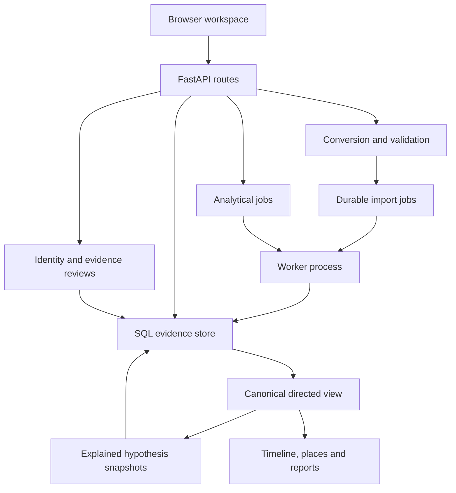

# V3 architecture

The V2 FastAPI + SQLAlchemy + static browser structure is retained. No framework rewrite or second authoritative graph database was introduced.

## Source graph and canonical graph

Entities and directed typed edges remain in the original V2 tables, including status, polarity, event time, source ID/excerpt, recorded time and revision. Parallel evidence is never deleted. Transaction is an allowed entity type; existing demo2 transactions remain transferred edges for compatibility.

`IdentityState.mapping` maps original members directly to a canonical root. Reviews compare a dataset fingerprint and update a case identity revision with compare-and-swap. `IdentityDecision` retains the before-map, feature evidence, actor, reason and time. Canonical views relink endpoints at query time and return original endpoints beside effective endpoints. Undo restores the previous map only for the latest active merge in a case. This is a reversible whole-merge undo; arbitrary individual-member splitting is not yet exposed. Subsequent evidence remains attached to its original IDs.

The original `/records` endpoint returns original endpoints. `/graph`, timeline, geo, links and reports use canonical endpoints. Focus queries expand canonical group members. `/projection?mode=communication|ownership|location|transactions|directed` selects accepted asserted typed records while preserving direction. Structural centrality and two-hop ranking intentionally use an undirected projection; explanations retain directed original records.

## Lead lifecycle

`links-3.0` computes signed contributions, evidence IDs, source IDs, paths and score. `/hypotheses/compute` stores content-addressed snapshots including graph fingerprint, algorithm and scope. Repeated identical computation returns the same snapshot and preserves its review state. `Hypothesis` is a separate table; reviews update its revision and audit trail, never the evidence table. Case brief links reopen saved scope. Older snapshots are historical results and are not silently updated.

## Work distribution

The existing worker services both import jobs and `AnalysisJob` rows. PostgreSQL uses transactional `FOR UPDATE SKIP LOCKED`. Computation and result storage commit together; unexpected exceptions roll back to queued. Expected validation errors become failed jobs. The UI queues lead computation for at least 2,000 loaded records and identity review for at least 1,000 loaded entities. Small requests run synchronously. API queue cap is five queued jobs per case, a best-effort cap rather than a distributed quota. Original import replay/atomicity remains unchanged.

The analytical worker currently calls shared computation helpers in the intelligence route module. A larger deployment should move these orchestration helpers into a dedicated application layer. SQLite is intentionally one worker. There is no object store, message broker, distributed analytics cache or migration framework.

## Research isolation

`research/benchmark.py` has real trainable PyTorch mean-GraphSAGE layers, a pair classifier, chronological graph/target separation, validation model selection and test metrics. It uses a small dense tensor adjacency. It is enabled explicitly with `--gnn`; it is not imported by the API or represented as live investigative confidence.
